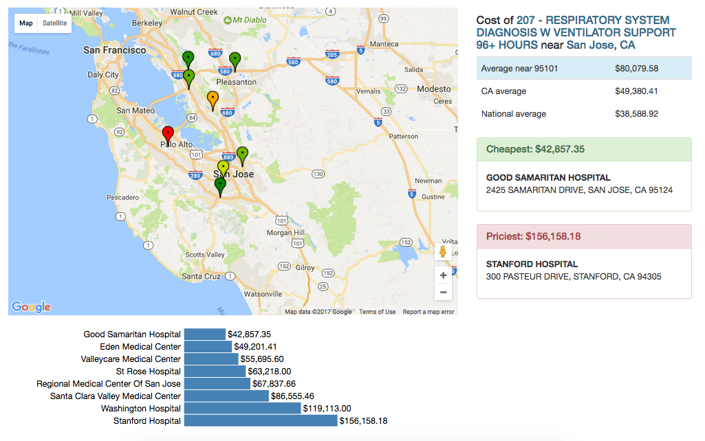

# Medicompare

> by [Neel Mehta](https://github.com/hathix) and [Allison Kao](https://github.com/ahkallison) for [Coding it Forward](http://codingitforward.com)

We've built a web app that helps patients to compare the costs of medical procedures at hospitals in their region. By making hidden healthcare costs more transparent, we're empowering citizens to take a stand on their health and wallet.

# Live demo

See the app live at <http://medicompare.herokuapp.com>!

# Setup

Just run:

```
npm install
npm install -g nodemon
```

# Running

Ensure you have [Nodemon](https://github.com/remy/nodemon) installed, then run:

```
nodemon
```

Then visit <http://localhost:3000>.

# Screenshots

New York: 

Silicon Valley: 

# Example procedures to search

Procedure                                                         | Zip   | City          | Comments
----------------------------------------------------------------- | ----- | ------------- | ----------------------------------------------------------
069 - TRANSIENT ISCHEMIA                                          | 10010 | New York      | Shows suburb-city split
870 - SEPTICEMIA OR SEVERE SEPSIS W MV 96+ HOURS                  | 02110 | Boston        | Local example
853 - INFECTIOUS & PARASITIC DISEASES W O.R. PROCEDURE W MCC      | 10010 | New York      | More expensive version of Ischemia
178 - RESPIRATORY INFECTIONS & INFLAMMATIONS W CC                 | 82001 | Cheyenne, WY  | More expensive & less choice in rural areas
195 - SIMPLE PNEUMONIA & PLEURISY W/O CC/MCC                      | 06501 | New Haven, CT | University hospitals more expensive
207 - RESPIRATORY SYSTEM DIAGNOSIS W VENTILATOR SUPPORT 96+ HOURS | 95101 | San Jose      | Most expensive procedures, stark regional cost differences

# Technologies

- Node.js/Express
- SQLite
- Gulp
- D3
- Bootstrap
- jQuery
- SCSS

# About Coding it Forward

[Coding it Forward](http://codingitforward.com) is an alliance of young people passionate about using their technology skills for social good. A big part of this is empowering consumers, improving healthcare, and bringing medicine into the digital age.
